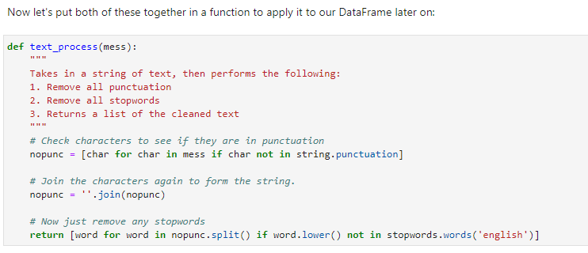
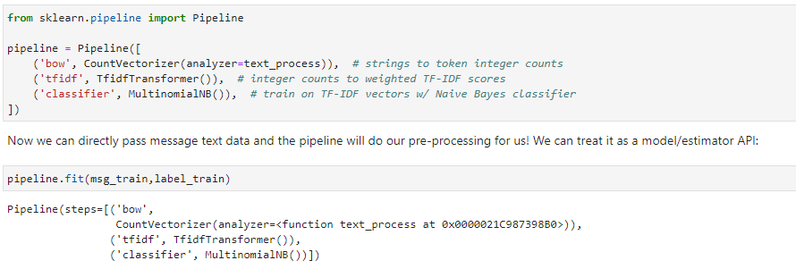

# Natural-Language-Processing

Using these labeled ham and spam examples, we'll train a machine learning model to learn to discriminate between ham/spam automatically. Then, with a trained model, we'll be able to classify arbitrary unlabeled messages as ham or spam.

EDA: messages.hist(column='length', by='label', bins=60,figsize=(12,4))

Spam messages tend to have more characters.

Text Pre-processing

    
Vectorization: TF-IDF

Train Test Split

Model Evaluation

Creating a Data Pipeline

from sklearn.pipeline import Pipeline

