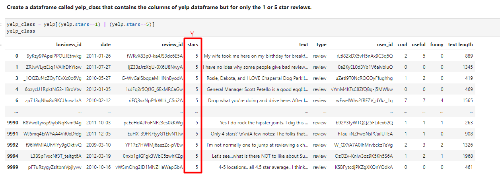
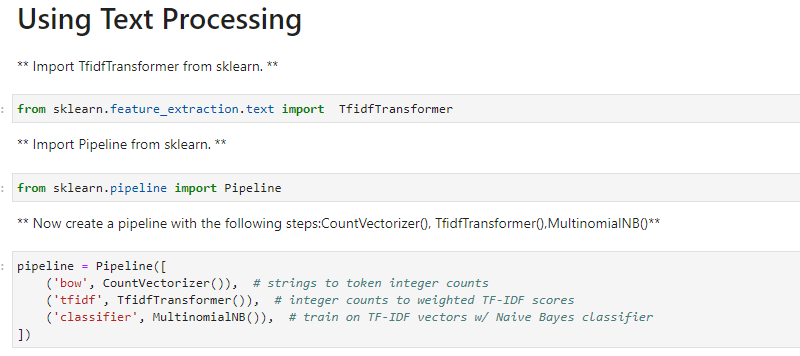
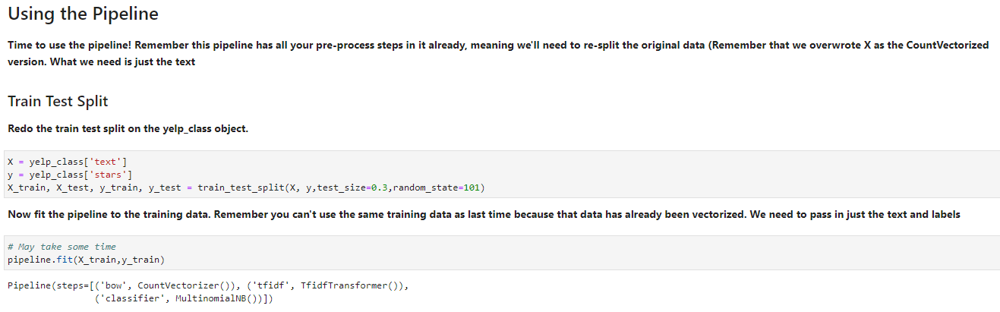

# Natural-Language-Processing

Using these labeled ham and spam examples, we'll train a machine learning model to learn to discriminate between ham/spam automatically. Then, with a trained model, we'll be able to classify arbitrary unlabeled messages as ham or spam.

EDA: messages.hist(column='length', by='label', bins=60,figsize=(12,4))

Spam messages tend to have more characters.

Text Pre-processing

    
Vectorization: TF-IDF

Train Test Split

Model Evaluation

Creating a Data Pipeline

from sklearn.pipeline import Pipeline

# Yelp Project 

EDA

Use FacetGrid from the seaborn library to create a grid of 5 histograms of text length based off of the star ratings: g = sns.FacetGrid(yelp,col='stars'), g.map(plt.hist,'text length', bins=50)

Create a boxplot of text length for each star category.

Create a countplot of the number of occurrences for each type of star rating.

Use the corr() method on that groupby dataframe to produce this dataframe.

NLP Classification Task

Using Text Processing and Using the Pipeline

